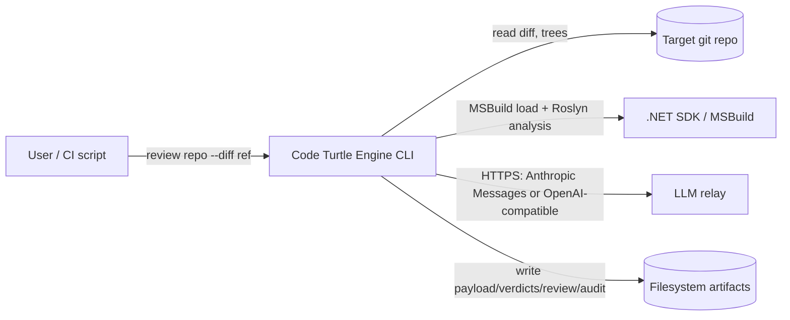
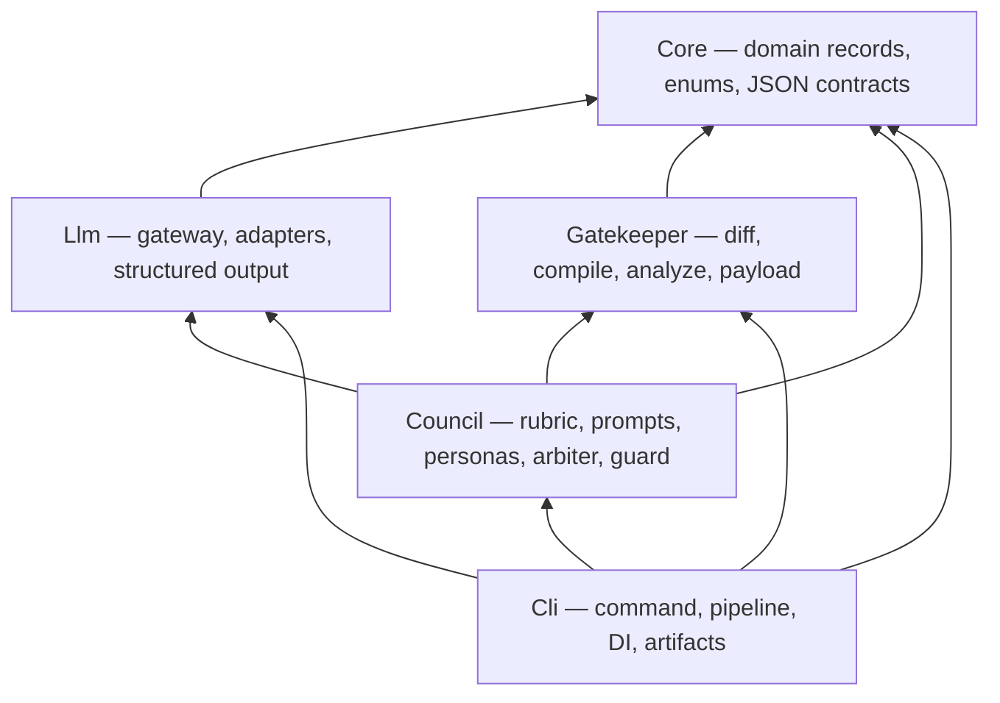
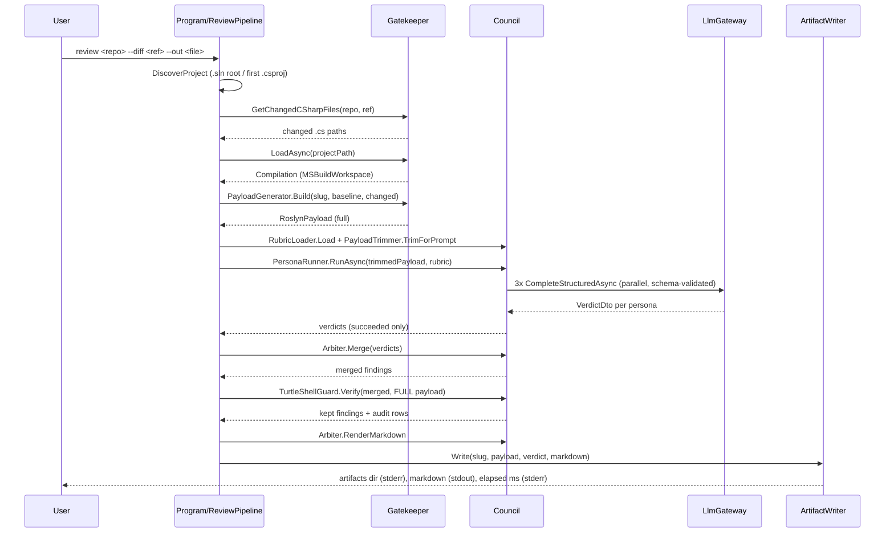
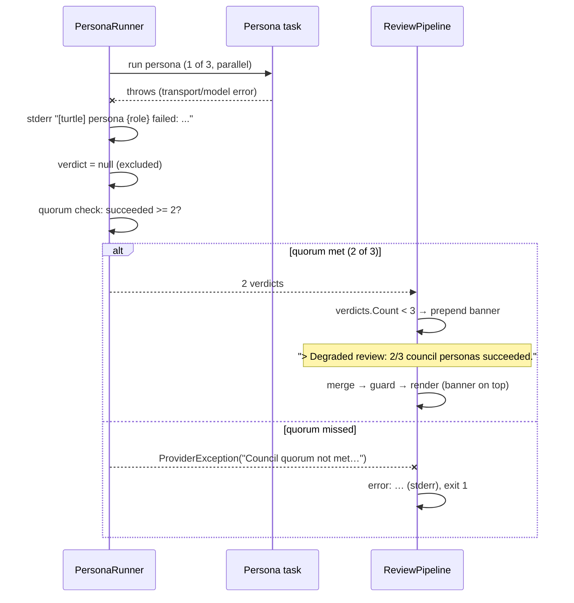

# Architecture — Code Turtle Engine

Engineering reference for the system behind the [README](README.md). Every statement
here is traceable to the source; where evidence is missing, the document says so.

---

## 1. Architecture Overview

Code Turtle Engine is a local CLI that reviews changed C# code with a council of LLM
personas, grounded in deterministic Roslyn compiler facts. The architecture is a
**layered pipeline**: deterministic stages (git diff → compilation → semantic payload)
produce a machine-derived evidence set; LLM stages (persona council → arbitration →
guard) consume and adjudicate it; the final stage persists artifacts.

The key quality goal is **zero-hallucination citation grounding**: every symbol a
review finding *cites* is checked, with ordinal string comparison, against the set of
symbols the Roslyn compilation actually resolved. Findings whose citations all fail
that check are stripped before the review is rendered. The guarantee is deliberately
narrow and precise — see §16 for exactly what is *not* covered.

There is no server, no database, no message broker, and no deployment target. The
process reads a target git repository, calls an LLM relay over HTTPS, and writes files.

## 2. Goals and Non-Goals

**Goals (established from the design spec and implementation):**

- Deterministic grounding: LLM reasoning operates on compiler-extracted facts, not raw
  source text alone.
- Citation integrity enforcement with a machine-checkable audit trail (`audit.json`).
- Fail-closed on the evidence chain: no diff, no compilation, or no quorum means no
  review (with one documented exception — §9).
- Hermetic testability: the entire pipeline runs offline against a mock `IChatClient`.

**Non-goals (MVP scope, documented in the design spec):**

- Cloud, CI, GitHub, and MCP integrations — deferred to later phases.
- Multi-project solution compilation — only the first project of a `.sln` is compiled.
- A compile-diagnostics gate — the loader does not reject code with C# errors (§9).
- LLM-based conflict resolution in the arbiter — merge is deterministic.

## 3. Constraints

- **.NET 10** (`global.json` pins SDK `10.0.100`, `rollForward: latestFeature`);
  `Directory.Build.props` sets `TreatWarningsAsErrors=true` and `Nullable` across all
  projects.
- **Single LLM access path in the development environment**: the Aliyun Token Plan
  relay exposes the **Anthropic Messages protocol only** (`POST {base}/v1/messages`),
  confirmed by a curl spike recorded in the adapter design spec. This drove the raw
  `HttpClient` adapter (§6) rather than an SDK dependency.
- **The target repository must be a git repo with a discoverable project**: a `.sln` at
  the repo root, or the first `.csproj` found by recursive search.
- The review latency is **relay-bound**: measured ~282 s wall time for a 3-persona
  review on the Token Plan relay (§13). The 60 s design target is unreachable on that
  endpoint with reasoning models.

## 4. System Context



Interactions:

- **User → CLI**: a single `review` command with one positional argument and three
  options (§6, CLI).
- **CLI → target repo**: read-only via LibGit2Sharp — tree-vs-tree or
  tree-vs-working-directory diff; the repository is never modified.
- **CLI → MSBuild/Roslyn**: `MSBuildWorkspace` loads the discovered project and
  produces a `Compilation`; semantic models are queried per changed file.
- **CLI → LLM relay**: HTTPS calls only, credentials from environment variables. No
  other network traffic exists.
- **CLI → filesystem**: review markdown to stdout/`--out`, plus a timestamped artifact
  directory under `$TURTLE_HOME`.

## 5. Container Architecture

Five projects form a strict dependency DAG (verified from `ProjectReference` entries
in each `.csproj`):



| Project | Responsibility | Key types | Inbound | Outbound |
|---|---|---|---|---|
| **Core** | Pure domain: payload/finding/verdict records, `Severity`/`PersonaRole`/`GuardMode` enums, `TurtleJson` serializer options | `RoslynPayload`, `ReviewFinding`, `PersonaVerdict`, `GuardResult`, `CouncilVerdict` | all projects | nothing (zero project references) |
| **Gatekeeper** | Deterministic evidence: git diff, compilation loading, semantic analysis, payload building | `DiffProvider`, `CompilationLoader`, `SemanticAnalyzer`, `TurtleSyntaxWalker`, `PayloadGenerator` | Council, Cli | Core; LibGit2Sharp; Roslyn (`Microsoft.CodeAnalysis.*` 5.9.0) |
| **Llm** | Transport: route fallback, resilience, protocol adapters, structured output with validation | `LlmGateway`, `ChatClientFactory`, `AnthropicMessagesChatClient`, `StructuredChatClient`, `ErrorClassifier`, `MockChatClient` | Council, Cli, tests | Core; `Microsoft.Extensions.AI.OpenAI` 10.9.0; Polly 8.7.0; `HttpClient` |
| **Council** | LLM adjudication: rubric, prompts, parallel personas, deterministic merge, citation guard, prompt-view trimming | `RubricLoader`, `PromptBuilder`, `PersonaRunner`, `Arbiter`, `TurtleShellGuard`, `PayloadTrimmer` | Cli | Core, Gatekeeper, Llm |
| **Cli** | Composition root and orchestration: `review` command, pipeline sequencing, DI wiring, artifact persistence | `Program`, `ReviewPipeline`, `Composition`, `ArtifactWriter` | user | all projects; System.CommandLine 3.0.0-rc.1 |

`ErrorClassifier` is implemented and unit-tested but has **no production caller** —
it is dead code today (§16).

## 6. Code Map

Where each behavior lives, in pipeline order:

- **CLI surface** — `src/CodeTurtleEngine.Cli/Program.cs`. Command `review <repo>`
  with `--project`, `--diff`, `--out` (all optional, default null). Exit `0` on
  success, `1` on any exception (message printed to stderr as `error: {message}`).
  Markdown review goes to stdout; `Artifacts: {dir}` and `elapsed: {N} ms` go to
  stderr. The elapsed timer covers the pipeline run only — not DI setup or project
  discovery.
- **Project discovery** — `Cli/Composition.cs`. `.sln` matched only at the repo root;
  otherwise the first `.csproj` found by recursive search.
- **Diff** — `Gatekeeper/DiffProvider.cs`. Without `--diff`: HEAD tree vs working
  directory (staged + unstaged tracked changes). With `--diff <ref>`: baseline commit
  tree vs HEAD tree — **uncommitted working-tree changes are excluded in this mode**.
  Filter: paths ending `.cs` (case-insensitive), deduplicated. Unknown baseline ref →
  `DiffException`.
- **Compilation load** — `Gatekeeper/CompilationLoader.cs`. `MSBuildWorkspace.Create()`,
  `OpenSolutionAsync`/`OpenProjectAsync`, `GetCompilationAsync`. For a solution, the
  **first enumerated project** is compiled; others are not. Failures and null
  compilations throw `CompilationException` with workspace disposal. No NuGet restore
  is performed and **no compilation diagnostics are checked** (§9).
- **Semantic analysis** — `Gatekeeper/SemanticAnalyzer.cs` +
  `Gatekeeper/TurtleSyntaxWalker.cs`. The walker collects `MethodDeclarationSyntax`
  nodes only — constructors, property accessors, and local functions are never
  analyzed. Per method:

  | Fact | Mechanism | Notes |
  |---|---|---|
  | `Dependencies` | Declared symbol's containing type → constructor parameter type names | Short names, deduplicated |
  | `Allocations` — boxing | `GetTypeInfo`: value type converted to `System.Object` | **To-`object` conversions only**; boxing to interfaces is not detected. One entry per line |
  | `Allocations` — LINQ closures | Invocation in `System.Linq` with a lambda argument that binds an identifier to an `ILocalSymbol` | One entry per offending invocation |
  | `AsyncHealth` | `async` method with an `await` whose expression is not `*.ConfigureAwait(...)` | **First offender only** per method |
  | `ResolvedSymbols` | Constructor parameter types + containing types of every invoked method symbol, as display strings | Ordinal-sorted; **this set is the guard's citation allow-list** |

- **Payload build** — `Gatekeeper/PayloadGenerator.cs`. Maps changed paths to syntax
  trees by loose suffix match (`PathsMatch`, ordinal-ignore-case, separator-normalized)
  — two files with the same path tail can collide (§16). Files with no matching tree or
  zero analyzed methods are skipped. Output: `RoslynPayload(RepoSlug, DiffBaseline,
  Files[FileFacts(FilePath, Methods[MethodFacts])])`.
- **Rubric and prompts** — `Council/RubricLoader.cs` (whole-file load of
  `turtle/rubric_v1.md`; missing file → `FileNotFoundException` → exit 1) and
  `Council/PromptBuilder.cs`. System message = persona instruction + rubric +
  grounding rules ("Do NOT invent symbols. Every finding MUST cite symbol FQNs that
  appear in the payload's ResolvedSymbols…"). User message = minified payload JSON.
  Strict JSON schema with all five finding fields required, including
  `CitedSymbolFqns`.
- **Prompt-view trimming** — `Council/PayloadTrimmer.cs`. Positional caps for the LLM
  view only: 40 files, 40 methods/file, 10 allocations/method, 20 resolved
  symbols/method. `Dependencies` and async-health facts are never trimmed. Immutable
  rebuild — the full payload object is untouched, and the guard receives the full one
  (§14 invariant).
- **Personas** — `Council/PersonaRunner.cs`. Three roles —
  `AllocationsPerformance`, `SecurityAuditor`, `IdiomaticArchitect` — run concurrently
  via `Task.WhenAll` (no degree cap). Model-role rule: `AllocationsPerformance` →
  `"fast"`, others → `"deep"`, resolved through `Llm:ModelRoles` (both currently map to
  `qwen3.8-flash`). A failing persona is caught, logged to stderr as
  `[turtle] persona {role} failed: {Type}: {detail}`, and yields `null`; a
  user-cancellation `OperationCanceledException` is rethrown, not swallowed. Quorum
  gate: fewer than `Quorum` (default 2) successes → `ProviderException` → exit 1.
- **Merge** — `Council/Arbiter.cs`. Dedupe key = (title trimmed + lowercased,
  location); the highest `Severity` wins within a group; final order = severity
  descending, then location ordinal ascending. Fully deterministic — no LLM involved.
- **Guard** — `Council/TurtleShellGuard.cs`. Allow-list = `HashSet<string>`
  (ordinal) of every `ResolvedSymbols` entry of the **full** payload. Each finding's
  `CitedSymbolFqns` are checked one by one; every check appends a
  `GuardResult(CitedFqn, Verified)` audit row. `Strip` mode (default): a finding is
  dropped iff it cites ≥1 symbol and none verified; mixed findings keep only their
  verified citations. `Flag` mode: findings pass through untouched; verification
  results exist **only in `audit.json`** — no markers in the rendered review.
  Citations are the structured JSON array only; finding prose (title, detail,
  location) is never verified.
- **Gateway** — `Llm/LlmGateway.cs`. Routes tried in configured order; **any**
  exception other than user-cancellation triggers the next route (auth errors, rate
  limits, timeouts, and model-output errors alike — no non-retryable distinction).
  Each route call is wrapped in a Polly pipeline: timeout 300 s, then circuit breaker
  (failure ratio 0.5, minimum throughput 4, sampling 30 s, break 30 s). **No retry
  policy** — fallback across routes replaces retrying one. The pipeline (and therefore
  the breaker) is built once per gateway: it is **global across routes**, not
  per-route. Exhaustion → `ProviderException` carrying a per-attempt log
  (`"{route}: {ExceptionType}: {message}"`). Unknown model role → `ModelException`
  before any route is tried.
- **Structured output** — `Llm/StructuredChat.cs`. The JSON schema is **always**
  prompt-injected ("Respond with ONLY a JSON value matching this schema, no prose");
  for openai-protocol routes `response_format` (`ChatResponseFormat.ForJsonSchema`) is
  additionally attempted first, degrading to prompt-only on non-`ModelException`
  failures. Response text is sliced from first `{` to last `}` (`ExtractJson`), parsed
  with `TurtleJson.Options`, and validated client-side; parse failure →
  `ModelException` → one JSON-retry (default `JsonRetries = 1`) of the whole attempt.
  `ProviderException` is never JSON-retried — routing owns transport failures.
  Caveat: because the degrade path catches transport exceptions too, a transport
  failure during the `response_format` attempt causes a **second full route walk** for
  the same logical call.
- **Adapters** — `Llm/ChatClientFactory.cs` selects per route `Protocol`:
  - `anthropic` → `Llm/AnthropicMessagesChatClient.cs`: raw `HttpClient`
    `POST {baseUrl}/v1/messages`, `Authorization: Bearer {key}` +
    `anthropic-version: 2023-06-01` (Bearer, not `x-api-key` — relay-specific),
    non-streaming, `max_tokens = 8192`. System messages folded into the top-level
    `system` string. Only `type == "text"` response blocks are extracted; `thinking`
    blocks are ignored. `HttpClient.Timeout = Timeout.InfiniteTimeSpan` — Polly owns
    the timeout. Missing `content` array → `ModelException`; non-2xx →
    `HttpRequestException` with status and body truncated to 500 chars.
  - `openai` → official OpenAI SDK via `AsIChatClient()`; the SDK's default retry
    policy applies on this path, and no transport timeout is configured (unlike the
    anthropic adapter).
- **Artifacts** — `Cli/ArtifactWriter.cs`. Directory:
  `$TURTLE_HOME/reviews/{slug}/{yyyyMMdd-HHmmss-fffffff}/` (UTC; `TURTLE_HOME`
  defaults to `~/.turtle`). `{slug}` is the **project file name** without extension,
  non-alphanumerics replaced by `_` — not the repository directory name. Four files,
  PascalCase JSON via `TurtleJson`: `payload.json` (full, untrimmed), `verdicts.json`
  (raw per-persona verdicts, pre-merge and pre-guard), `review.md` (final markdown,
  banner included), `audit.json` (one `{CitedFqn, Verified}` row per citation
  attempted). The directory is always created, even with zero findings.
- **Configuration** — `Cli/appsettings.json` + `Cli/Composition.cs`. Sections `Llm`
  (routes, model roles, `JsonRetries`) and `Turtle` (rubric path, council knobs:
  `Quorum 2`, `Guard Strip`, trim caps, `MaxFindingsPerPersona 5`). Environment
  variables layer over the JSON file. Config holds **env-var names only** — never
  values (§11).

## 7. Runtime Workflows

### 7.1 Review — happy path

Ordering matters: the arbiter merges **before** the guard verifies, so the guard
audits the deduplicated finding set.



### 7.2 Persona failure and degraded review



User cancellation is the exception to the catch-all: an
`OperationCanceledException` with `ct.IsCancellationRequested` is rethrown from the
persona task and aborts the review.

### 7.3 LLM call failure inside one persona

```mermaid
sequenceDiagram
    participant SC as StructuredChat
    participant GW as LlmGateway
    participant RT as Route N (anthropic adapter)
    participant PP as Polly pipeline
    SC->>GW: CompleteStructuredAsync(schema prompt [+ response_format])
    loop each configured route, in order
        GW->>PP: ExecuteAsync(call, ct)
        PP->>RT: POST /v1/messages (timeout 300s, breaker)
        alt success + valid JSON
            RT-->>SC: VerdictDto
        else malformed JSON
            RT-->>GW: ModelException
            GW->>GW: attempt-log entry, next route
        else transport/timeout/breaker open
            RT-->>GW: HttpRequestException / TimeoutRejectedException / BrokenCircuitException
            GW->>GW: attempt-log entry, next route
        else user cancel (ct)
            GW-->>SC: OperationCanceledException (rethrown, no fallback)
        end
    end
    GW--xSC: ProviderException(attempt log) — all routes failed
    SC-->>SC: NOT JSON-retried (transport plane); surfaces to PersonaRunner catch
    Note over SC: ModelException alone → JSON-retry (default 1) before surfacing
```

## 8. Data Architecture

There is no database, no cache layer, no migrations, and no transaction boundaries.

- **Input data** is the target git repository, read-only through LibGit2Sharp (object
  model: commits, trees, `TreeChanges`).
- **In-memory data** is the `RoslynPayload` object graph — the single source of
  grounding truth for one review run. The trimmed prompt view is a separate immutable
  projection; the full payload is never mutated.
- **Persisted data** is the artifact directory: append-only, one timestamped folder
  per run, four files (§6, Artifacts). Nothing reads artifacts back; they exist for
  human audit.

Consistency model: a single process, a single run, no shared state — concurrency is
limited to the three parallel persona tasks, which share no mutable state (each builds
its own prompt and verdict).

## 9. Reliability and Failure Handling

| Mechanism | Implementation | Evidence |
|---|---|---|
| Timeout (anthropic path) | Polly `AddTimeout(300s)` is the sole timeout authority; `HttpClient.Timeout = InfiniteTimeSpan` disables the hidden 100 s default that previously killed deep-reasoning calls | `LlmGateway`, `AnthropicMessagesChatClient` |
| Timeout (openai path) | SDK default applies; no explicit transport timeout configured | `ChatClientFactory` |
| Circuit breaker | Polly: failure ratio 0.5, min throughput 4, sampling 30 s, break 30 s. **Global to the gateway — shared across routes**, per-route isolation deferred | `LlmGateway.DefaultPipeline` |
| Retry | **None, deliberately.** Polly retry was removed after live tuning showed retries compound on a slow relay; ordered route fallback is the recovery mechanism | commit history (`perf: drop Polly retry stage`) |
| Route fallback | Any non-user-cancel exception advances to the next route; exhaustion → `ProviderException` with a per-attempt log surfaced in persona diagnostics | `LlmGateway` |
| Malformed model output | Client-side JSON validation + slice extraction; `ModelException` triggers one JSON-retry of the whole attempt (`JsonRetries = 1`) | `StructuredChat` |
| Persona failure isolation | Per-persona try/catch → `null`; failure never aborts sibling personas | `PersonaRunner` |
| Quorum | Fewer than 2 of 3 successes → `ProviderException` → exit 1 (fail-closed) | `PersonaRunner` |
| Graceful degradation | Exactly 2 of 3 → review proceeds with a visible banner in stdout and `review.md` | `ReviewPipeline` |
| Cancellation | `CancellationToken` threaded through gateway, loader, and personas; user-cancel OCE rethrown (never converted to `ProviderException`); pre-cancelled token surfaces OCE (unit-tested) | `LlmGateway`, `PersonaRunner` |

**Fail-closed points**: missing project, diff failure, unknown baseline ref,
compilation *load* failure, missing rubric, quorum miss — each aborts with exit 1.

**Not fail-closed**: compilation *diagnostics*. The loader checks that a `Compilation`
object exists but never calls `GetDiagnostics()`; a project with C# compile errors
still produces semantic models, and the pipeline proceeds on degraded analysis. This
is an explicit known limitation (§16), not an oversight to paper over: the design
spec's "must compile" prerequisite is a documented user-facing requirement, not an
enforced gate.

## 10. Observability

No logging framework, no metrics, no distributed tracing, no health checks — the
process is a short-lived CLI. What exists:

- **stderr contract** (exact formats):
  - `Artifacts: {directory}`
  - `elapsed: {N} ms` (pipeline wall time)
  - `error: {message}` (any fatal exception; exit 1)
  - `[turtle] persona {role} failed: {ExceptionType}: {detail}` — for
    `ProviderException`, `{detail}` is the joined route attempt-log, so a transport
    failure shows every route tried and why it failed.
- **Artifact audit trail**: `audit.json` records one `{CitedFqn, Verified}` row per
  citation attempted — the ground-truth record of the zero-hallucination check for any
  run. `payload.json` (full, untrimmed) and `verdicts.json` (raw, pre-guard) let a
  reviewer reconstruct exactly what the models saw and said.
- **stdout**: the review markdown itself, including the degraded banner when
  applicable.

To trace a workflow after the fact: `review.md` for the outcome, `audit.json` for
citation integrity, `verdicts.json` for per-persona raw output, stderr for transport
diagnostics.

## 11. Security Architecture

This is a local CLI with no listening surface, no user accounts, and no authorization
model. The security-relevant properties are secret handling and trust boundaries:

- **Secrets**: configuration stores environment-variable *names* only
  (`BaseUrlEnv`, `ApiKeyEnv`); values are read via
  `Environment.GetEnvironmentVariable` in `ChatClientFactory` at call time. A
  repository-wide audit found zero literal credentials in tracked files. Keys travel
  as `Authorization: Bearer` over HTTPS to the configured relay only.
- **Trust boundary — LLM output**: model responses are treated as untrusted structured
  data. They are schema-validated (`additionalProperties: false`, required fields),
  sliced to the JSON span, parsed with strict options, and — for citations — verified
  against compiler truth before publication. The guard is an **integrity control**
  (preventing fabricated citations from reaching the review), not a security control.
- **Trust boundary — target repository**: repo content is read and compiled, never
  executed by the engine beyond MSBuild's normal project evaluation during
  `MSBuildWorkspace` loading. Running the engine against an untrusted repository
  carries the same risk as running `dotnet build` against it.
- No claim of "secure" or "production hardened" is made or warranted: the tool has no
  authentication surface to harden.

## 12. Deployment

There is no deployment architecture. The tool runs as `dotnet run` (or a published
binary) on a developer machine or CI runner; artifacts land on the local filesystem.
No Dockerfile, compose file, orchestration manifest, or cloud configuration exists in
the repository.

CI: `.github/workflows/ci.yml` builds the solution and runs the **hermetic** test
suite (offline; live smoke tests self-skip without `TURTLE_LIVE=1`) on push and pull
request. CI never contacts an LLM endpoint and needs no secrets.

## 13. Scalability Characteristics

- Single process, single review per invocation; no horizontal-scaling mechanism
  exists or is claimed.
- Council concurrency is three unbounded `Task`s — wall time equals the slowest
  persona.
- **Measured, not benchmarked**: a live 3-persona review of the engine's own Llm
  project took ~282 s wall on the Token Plan relay (qwen3.8-flash, reasoning-bound,
  ~100–280 s per persona). Payload trimming helped marginally; the binding constraint
  is model reasoning time on that relay, not payload size. These are single-endpoint
  observations from development runs — no throughput, load, or percentile data exists.
- Payload caps (40 files × 40 methods × 20 symbols) bound prompt growth for large
  diffs; the guard's allow-list stays full-size regardless.

## 14. Architectural Invariants

Structural rules that hold in the current code (verifiable from project references
and the cited call sites):

1. **Core depends on nothing.** Zero `ProjectReference` entries; pure records, enums,
   and JSON options.
2. **Gatekeeper and Llm are mutually independent.** Neither references the other;
   deterministic evidence and LLM transport evolve separately.
3. **Council never touches git or Roslyn directly.** It consumes `Core` payload
   records; all compiler interaction lives in Gatekeeper.
4. **The guard's allow-list is always built from the full, untrimmed payload.**
   `ReviewPipeline` trims a separate prompt-view object (`TrimForPrompt`) and passes
   the original payload to `TurtleShellGuard.Verify`. Trimming can shrink prompts but
   can never weaken grounding.
5. **Cli is the sole composition root.** All DI binding happens in
   `Composition.BuildServices`; library projects take dependencies via constructor
   interfaces.
6. **Secrets never appear in configuration files** — env-var names only (§11).

## 15. Architectural Tradeoffs

Items marked *documented* have recorded rationale (design specs, spike results, or
commit messages); items marked *observed* are implementation facts whose historical
intent is not recorded and should be confirmed by the owner before being presented as
decisions.

| # | Decision | Benefit | Cost | Status |
|---|---|---|---|---|
| 1 | `MSBuildWorkspace` over Buildalyzer for compilation loading | No extra dependency, no build roundtrip; measured ~3 s warm load with zero compilation errors in the spike | Workspace enumeration quirks (obsolete `WorkspaceFailed` event; first-project-only for solutions) | **Documented** — `spikes/RESULTS.md` with probe code and metrics |
| 2 | Raw `HttpClient` Anthropic adapter instead of an SDK | The relay exposes the Anthropic Messages protocol only; a small adapter avoided a dependency and matched the `IChatClient` abstraction the gateway already had | Hand-maintained protocol details (header names, thinking-block filtering); no SDK retry behavior on this path | **Documented** — adapter design spec, protocol confirmed by curl spike |
| 3 | No Polly retry policy; ordered route fallback instead | Retries were observed to compound latency on a slow relay (each retry re-paid ~100+ s); fallback fails over instead of waiting | A transient blip on a single-route deployment has no second chance | **Documented** — commit `perf: drop Polly retry stage` |
| 4 | Deterministic arbiter (no LLM conflict resolution) | Merge is reproducible and free; dedupe/ordering fully unit-testable | Cross-persona disagreements are resolved by severity rank, not reasoning | **Documented** — MVP scope decision; LLM arbiter is roadmap |
| 5 | Single gateway-global circuit breaker | One resilience pipeline, simple to reason about | One bad route can open the breaker for all routes; per-route isolation deferred | **Documented** — Phase 2 queue |
| 6 | Findings cap enforced by prompt text only (no post-hoc `Take`) | Simpler pipeline; schema validation stays the only output filter | A model ignoring the cap returns more than `MaxFindingsPerPersona` findings | *Observed* |
| 7 | `ErrorClassifier` shipped but unwired | HTTP-status taxonomy exists and is tested for future per-error routing policy | Dead code in the production path today | *Observed* |

## 16. Known Limitations / Technical Debt

Factual inventory from code audit; none of these are hidden — most are tracked as
Phase 2 work.

**Grounding scope (by design, but worth stating precisely):**

- The guard verifies **cited symbol FQNs only**. A finding that cites zero symbols
  passes `Strip` mode completely unverified (the drop condition requires ≥1 citation).
- Finding **prose is never checked**: a hallucinated file:line `Location`, invented
  line numbers, or a fabricated `Detail` riding on one real citation all survive the
  guard.
- `Flag` mode produces no visible markers in `review.md` — verification results live
  only in `audit.json`. `[verified]`/`[unverified]` markers are roadmap.
- The trimmer's doc comment ("a model can only cite symbols it is shown") is a prompt
  assumption, not a code invariant: a model could cite a real FQN from a trimmed-away
  method and pass the guard (still compiler-grounded, but not payload-grounded).

**Deterministic analysis:**

- Compile diagnostics are never checked — code with C# errors is still analyzed (§9).
- Only the first project of a `.sln` is compiled; multi-project solutions are Phase 2.
- Only `MethodDeclarationSyntax` is analyzed: constructors, property accessors, and
  local functions are invisible to the payload.
- Boxing detection covers value-type→`object` conversions only; boxing to interfaces
  (e.g. `IComparable`) is missed.
- `PathsMatch` uses loose suffix matching — changed paths with identical tails in
  different directories can attach the wrong syntax tree.
- Async-health reports only the first missing-`ConfigureAwait` offender per method.

**Transport/config:**

- `RouteOptions.Model` is accepted by configuration but ignored — model selection is
  governed solely by `ModelRoles`.
- The circuit breaker is gateway-global, not per-route.
- The openai-protocol path carries the SDK's implicit default retries and no explicit
  transport timeout (the anthropic path has neither issue).
- Factory-created chat clients are never disposed — per-call `HttpClient` churn on the
  anthropic path.
- On a transport failure during the `response_format` attempt, `StructuredChat`'s
  degrade path fires a second full route walk for the same logical call.

**Testing/ops:**

- `LiveSmokeTests` self-skip via early return when `TURTLE_LIVE` is unset — they
  report as *passed*, not skipped, in offline runs.
- Live-run evidence (the 48/0 citation audit, latency figures) exists in commit
  messages and local artifacts, not as committed fixtures; it is not reproducible from
  the repository alone without relay credentials.
- The 60 s latency target in the original design spec is unreachable on the Token Plan
  relay (reasoning-bound, ~282 s measured); remaining levers are a faster model,
  fewer personas, streaming, or a different endpoint.

## 17. Architectural Decision Records

Formal ADRs do not exist yet. [`docs/adr/README.md`](docs/adr/README.md) lists
**candidate ADRs** — decisions visible in the implementation whose rationale should be
confirmed by the project owner before being formalized. The one decision with complete
recorded evidence today is the Roslyn loader choice (§15 #1,
[`spikes/RESULTS.md`](spikes/RESULTS.md)).
