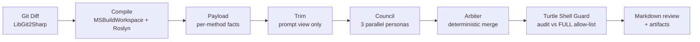

# 🐢 Code Turtle Engine

An AI code reviewer whose cited symbols are verified against a real Roslyn compilation — hallucinated API citations are stripped before the review reaches you. The engineering challenge: LLM reviewers invent symbols that do not exist, and nothing downstream can tell invented from real without a compiler.

Scope of the guarantee: the Turtle Shell guard audits the **citation channel** — every fully-qualified symbol a finding cites is checked (Ordinal exact match) against the set of symbols Roslyn actually resolved. Findings that cite no symbols pass through as advisory; the guard does not verify prose, descriptions, or file:line locations.

[](https://github.com/prasadrane/Code-Turtle-Engine/actions/workflows/ci.yml)


<!-- TODO: record a demo GIF of a live review run -->

## Review output shape

Illustrative — actual output depends on the reviewed diff:

```markdown
# Code Turtle Review - MyProject

Diff baseline: `main` - Files reviewed: 4

## [Warning] Missing ConfigureAwait(false)

- **Persona:** AllocationsPerformance
- **Location:** `src/Services/PaymentService.cs:42`
- Awaiting `HttpClient` without ConfigureAwait(false) risks deadlocks in library code.
- **Symbols:** `System.Net.Http.HttpClient`, `System.Threading.Tasks.Task`
```

## Problem

LLM-based reviewers produce confident findings about methods and types that were never in the codebase. Code Turtle Engine eliminates that failure class for cited symbols: every changed C# project is compiled with Roslyn first, the compilation produces a deterministic payload of per-method facts, and a guard audits every symbol citation in every finding against the compiler's own resolved-symbol set. The interesting design tension is latency vs. integrity — the prompt payload is trimmed for token/latency budgets, but the guard always audits against the **full, untrimmed** allow-list, so trimming can never weaken grounding.

## Key capabilities

- **Compiler-grounded payload** — per changed method: async `ConfigureAwait(false)` health, value-type→`object` boxing, LINQ closures capturing locals, constructor dependency types, and the Roslyn-resolved symbol set (the guard's allow-list).
- **Parallel persona council** — 3 LLM personas (Allocations & Performance, Security Auditor, Idiomatic Architect) run concurrently against the same payload; quorum gate (default 2/3) and a degraded-review banner when fewer than 3 succeed.
- **Turtle Shell guard** — Ordinal exact-match audit of every cited FQN; `Strip` mode drops findings whose citations all fail verification and prunes false citations from mixed findings; `Flag` mode records the audit in `audit.json` and keeps findings untouched.
- **Deterministic arbiter** — dedupes by lowercased title + location keeping max severity, orders severity-descending then location; no LLM in the merge path.
- **Dual-protocol LLM gateway** — OpenAI-compatible path (Microsoft.Extensions.AI) and a raw Anthropic Messages adapter; ordered route fallback, Polly 300 s timeout + circuit breaker, JSON-schema structured output with client-side validation and one malformed-JSON retry.
- **Hermetic test suite** — 64 offline tests: mock `IChatClient`, injected `HttpMessageHandler` for the adapter, a fixture repo compiled by the real Roslyn loader with 6 seeded defect classes; live tests opt-in via `TURTLE_LIVE=1`.
- **Audit artifacts** — every run writes `payload.json` (full, untrimmed), `verdicts.json` (raw, pre-guard), `review.md`, and `audit.json` (verified true/false per citation).

## Architecture snapshot



Trim affects only what the LLMs see; the guard audits against the full untrimmed allow-list from the compilation. Full detail: [ARCHITECTURE.md](ARCHITECTURE.md).

## Engineering highlights

**Zero-hallucination citation chain.** The LLMs receive a strict JSON schema requiring a `CitedSymbolFqns` array and grounding rules forbidding invented symbols. After merge, the guard checks each cited FQN with `StringComparer.Ordinal` against a `HashSet` built from the full payload's `ResolvedSymbols`. A finding is dropped when it cites symbols and none verify; a mixed finding keeps only its verified citations. Honest scope: a finding citing zero symbols passes as advisory, and prose (titles, details, locations) is never verified — the guarantee covers the citation channel only.

**Root-causing a hidden transport timeout.** Live reviews intermittently failed with deep-reasoning personas. The cause was not relay flakiness: `HttpClient`'s default 100-second timeout silently killed every long call regardless of the Polly timeout wrapping it. Setting `Timeout.InfiniteTimeSpan` on the adapter's client makes Polly (300 s) the single timeout authority; after the fix, 3/3 personas succeeded consistently (commit `cb57d43`).

**Trim vs. grounding separation.** Prompt payloads are capped for latency (`MaxFiles` 40, `MaxMethodsPerFile` 40, `MaxSymbolsPerMethod` 20, `MaxAllocationsPerMethod` 10) and rebuilt immutably — the guard is invoked with the original full payload. Caps can reduce what a model is *shown*, never what it is *held to*.

**Protocol adapter, not rewrite.** The available relay (Aliyun Token Plan) exposes the Anthropic Messages protocol only. Because the gateway was already `IChatClient`-abstract, adding `AnthropicMessagesChatClient` (raw `HttpClient`, `Authorization: Bearer` + `anthropic-version: 2023-06-01`, thinking-blocks ignored, text-only extraction) was an adapter addition; `Protocol: "anthropic" | "openai"` selects the path per route.

## Technology stack

| Technology | Responsibility |
|---|---|
| .NET 10 (`global.json` pins 10.0.100, `TreatWarningsAsErrors`) | Runtime for all projects |
| Roslyn `Microsoft.CodeAnalysis` 5.9.0 | Compilation + semantic analysis (symbol resolution, type info) |
| `MSBuildWorkspace` | Loads `.csproj`/`.sln` into a Roslyn compilation |
| LibGit2Sharp 0.32 | Git diff: working-tree vs HEAD, or baseline-ref tree-vs-tree |
| `Microsoft.Extensions.AI.OpenAI` 10.9.0 | `IChatClient` abstraction; OpenAI-compatible route path |
| Polly 8.7.0 | Timeout (300 s) + circuit breaker around every LLM call |
| System.CommandLine 3.0.0-rc.1 | CLI parsing (`review` command) |
| xUnit | Unit, integration, and opt-in live tests |

## Repository structure

```text
src/
  CodeTurtleEngine.Core/        domain records, enums, JSON contracts (no dependencies)
  CodeTurtleEngine.Gatekeeper/  LibGit2Sharp diff · MSBuildWorkspace loader · Roslyn analyzer · payload builder
  CodeTurtleEngine.Llm/         gateway (fallback + Polly) · OpenAI & Anthropic adapters · structured output
  CodeTurtleEngine.Council/     rubric · prompts · persona runner · arbiter · Turtle Shell guard · payload trimmer
  CodeTurtleEngine.Cli/         review command · pipeline orchestration · DI composition · artifacts
tests/                          6 projects (Core 2 · Gatekeeper 8 · Llm 31 · Council 18 · Cli 3 · Integration 2)
turtle/rubric_v1.md             council rubric (severity ladder, grounding rules, persona focus)
docs/                           design specs, implementation plans, ADR candidates
spikes/                         evidence-backed tech decisions (RESULTS.md + probe code)
.github/workflows/ci.yml        build + offline test suite on push/PR
```

Project references flow one way: `Core` ← {`Gatekeeper`, `Llm`} ← `Council` ← `Cli`.

## Quick start

Prerequisites:

- .NET 10 SDK (`global.json` pins 10.0.100, `rollForward: latestFeature`)
- A C# repository to review. The loader fails closed when the project/solution cannot be *loaded*, but it does not gate on compile diagnostics — a repo with C# errors still yields a semantic model and the review proceeds with degraded analysis.
- LLM endpoint credentials (any OpenAI-compatible or Anthropic-Messages endpoint; configured out of the box for Aliyun Bailian Token Plan, `qwen3.8-flash`).

```bash
# Credentials are referenced by env-var NAME from appsettings — no secrets in the repo
export TURTLE_LLM_BASE_URL="https://token-plan.<region>.maas.aliyuncs.com/apps/anthropic"
export TURTLE_LLM_API_KEY="<key>"

dotnet build
dotnet test                   # 64 offline tests, no credentials needed
TURTLE_LIVE=1 dotnet test     # adds live smoke tests (requires credentials)

dotnet run --project src/CodeTurtleEngine.Cli -- review /path/to/repo \
  --diff main --out review.md
```

## Usage

```text
turtle review <repo> [--diff <ref>] [--project <path.csproj|.sln>] [--out <file>]
```

| Flag | Behavior | Default |
|---|---|---|
| `--diff <ref>` | Baseline branch/SHA → **tree-vs-tree, baseline..HEAD; uncommitted changes excluded** | no flag → HEAD tree vs working directory (**includes** uncommitted changes) |
| `--project <path>` | Project or solution to compile; for a `.sln` only the **first** project is compiled | `.sln` at repo root, else first `.csproj` found recursively |
| `--out <file>` | Also write the markdown review to this path | artifacts only |

- Exit codes: `0` success, `1` any pipeline error (`error: {message}` on stderr, no stack trace).
- stdout: the markdown review. stderr: `Artifacts: {dir}` and `elapsed: {N} ms` (wall time of the pipeline).
- Artifacts: `$TURTLE_HOME` (default `~/.turtle`)`/reviews/{project-file-slug}/{UTC yyyyMMdd-HHmmss-fffffff}/` containing `payload.json`, `verdicts.json`, `review.md`, `audit.json`.

### Configuration (`src/CodeTurtleEngine.Cli/appsettings.json`)

- `Llm:Routes[]` — `Name`, `Protocol` (`anthropic` | `openai`), `BaseUrlEnv`, `ApiKeyEnv`. The per-route `Model` field is currently ignored: model selection is governed by `Llm:ModelRoles` (`deep`/`fast`, both `qwen3.8-flash` in the shipped config). `Llm:JsonRetries` (default 1) re-rolls malformed-JSON model output.
- `Turtle:Council` — `Quorum` 2 · `Guard` `Strip`|`Flag` · `MaxSymbolsPerMethod` 20 · `MaxAllocationsPerMethod` 10 · `MaxMethodsPerFile` 40 · `MaxFiles` 40 · `MaxFindingsPerPersona` 5 (prompt-level cap).
- `Turtle:RubricPath` — default `turtle/rubric_v1.md`.

## Testing

| Project | Tests | Layer |
|---|---|---|
| Core.Tests | 2 | JSON contracts, enums-as-strings |
| Gatekeeper.Tests | 8 | Real Roslyn compile of fixture repo, diff (temp git repos), payload |
| Llm.Tests | 31 | Factory protocol switch, gateway fallback/cancellation, adapter via injected `HttpMessageHandler`, structured-output retry |
| Council.Tests | 18 | Prompts, quorum, arbiter dedupe/order, guard Strip/Flag, trimmer |
| Cli.Tests | 3 | DI composition, pipeline orchestration, artifact writing |
| Integration.Tests | 2 | Hermetic e2e + live smoke (opt-in) |
| **Total** | **64** | All green offline (verified 2026-09-09) |

Hermetic by construction: `MockChatClient` replaces the LLM; `tests/fixtures/SampleRepo` is compiled by the real loader and seeds six defect classes (SQL-string concat, missing `ConfigureAwait`, LINQ closure, boxing, unawaited task, captive DI). The e2e test proves the guard strips a hallucinated citation (`SampleRepo.DoesNotExist`) while keeping a grounded one (`IPaymentGateway`). Live smoke skips via early return unless `TURTLE_LIVE=1` — it passes vacuously offline. CI ([.github/workflows/ci.yml](.github/workflows/ci.yml)) runs build + the offline suite on push and PR.

## Verified in live use

Dogfooded — the engine reviewing its own codebase (measurements recorded in git history; not reproducible from the repo without relay credentials):

- **Zero hallucinations on live output**: 48 symbol citations audited across 3 personas — 48 verified true, 0 false.
- **Real findings caught**: missing `ConfigureAwait(false)` across the async adapter, implicit boxing on a hot path — confirmed by hand.
- **Resilience exercised**: quorum (2/3) + degraded-review banner kept a review alive when one persona returned malformed JSON.
- **Latency**: ~282 s wall for a 3-persona live review on the Token Plan relay — bound by relay + model reasoning time, not a benchmark.

## Detection scope

Deterministic today (method declarations only — constructors, property accessors, and local functions are not analyzed): missing `ConfigureAwait(false)`, implicit boxing (value-type→`object` conversions only; interface boxing not caught), LINQ closures capturing locals, constructor dependency facts, resolved-symbol grounding.

Roadmap (from the design specs): custom Roslyn analyzers for dangerous casts, unawaited tasks, and captive-DI lifetimes (the test fixture already seeds these classes); LLM-assisted arbiter conflict resolution; multi-project solution compilation; visible `[verified]`/`[unverified]` markers in `Flag` mode; GitHub/CI/MCP integration; per-route circuit breakers.

## Docs

- [ARCHITECTURE.md](ARCHITECTURE.md) — as-built architecture: components, runtime flows, reliability, invariants, tradeoffs
- [docs/adr/README.md](docs/adr/README.md) — candidate ADRs (decisions visible in code, rationale awaiting owner confirmation)
- [CONTRIBUTING.md](CONTRIBUTING.md) · [SECURITY.md](SECURITY.md) · [AGENTS.md](AGENTS.md)
- Design specs and implementation plans under [docs/superpowers/](docs/superpowers/) — dated snapshots of the design process; ARCHITECTURE.md is the as-built reference
- [spikes/RESULTS.md](spikes/RESULTS.md) — Spike A evidence for the MSBuildWorkspace-over-Buildalyzer decision (relay protocol evidence lives in the [adapter spec](docs/superpowers/specs/2026-09-09-anthropic-adapter-design.md))
- [turtle/rubric_v1.md](turtle/rubric_v1.md) — the council rubric

## Contributing

See [CONTRIBUTING.md](CONTRIBUTING.md).

## License

[MIT](LICENSE)
