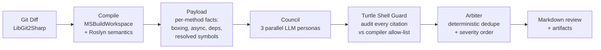

# 🐢 Code Turtle Engine

**An AI code reviewer that cannot hallucinate the APIs it cites.**

LLM-based reviewers invent symbols that do not exist — confident findings about methods and types that were never in your codebase. Code Turtle Engine eliminates that failure class: every C# project is compiled with **Roslyn** first, and a deterministic **Turtle Shell guard** audits every symbol citation in every LLM finding against the compiler's own resolved-symbol allow-list. Hallucinated citations are stripped before the review ever reaches you.

```
dotnet run --project src/CodeTurtleEngine.Cli -- review /path/to/repo --diff main --out review.md
```

## How it works



| Stage | Component | What it does |
|---|---|---|
| **Diff** | `Gatekeeper.DiffProvider` | Changed `.cs` files vs a baseline ref (LibGit2Sharp, tree-vs-tree) |
| **Compile** | `Gatekeeper.CompilationLoader` | Loads the full project with `MSBuildWorkspace` — fails closed if the repo does not compile |
| **Analyze** | `Gatekeeper.SemanticAnalyzer` | Per changed method: missing `ConfigureAwait(false)`, implicit boxing, LINQ closures, constructor dependencies, and the Roslyn-resolved symbol set |
| **Council** | `Council.PersonaRunner` | Three personas in parallel — *Allocations & Performance*, *Security Auditor*, *Idiomatic Architect* — each grounded in the same compiler-derived payload (Aliyun Qwen via an OpenAI- or Anthropic-protocol gateway) |
| **Guard** | `Council.TurtleShellGuard` | Ordinal exact-match audit of every cited symbol against the full allow-list; `Strip` mode drops zero-verified findings, `Flag` mode annotates them |
| **Arbiter** | `Council.Arbiter` | Deterministic merge: dedupe by title + location keeping highest severity, then severity ordering |
| **Artifacts** | `Cli.ArtifactWriter` | Review markdown plus payload, verdicts, and guard audit JSON under `$TURTLE_HOME/reviews/{repo}/{timestamp}/` |

### The zero-hallucination guarantee

The LLMs see a *trimmed* payload view (capped symbols/methods/files for latency), but the guard audits against the **full, untrimmed** allow-list — so trimming can reduce prompt size but can never weaken grounding. Findings that cite no symbol pass through as advisory; anything citing a symbol the compiler never resolved is stripped. This chain is verified end-to-end in tests and confirmed on live model output (see below).

## Verified in production use

Dogfooded on its own codebase — the engine reviewing the engine:

- **Zero hallucinations on live output**: 48 symbol citations audited across 3 personas — 48 verified true, 0 false. Models cited only real compiler-resolved symbols.
- **Real findings caught**: missing `ConfigureAwait(false)` across the async adapter, implicit boxing on a hot path — confirmed by hand.
- **Resilience proven**: quorum (2/3) + degraded-review banner survived a persona returning malformed JSON.
- **64/64 offline tests green** — the full pipeline runs hermetically against a mock `IChatClient`; live tests are opt-in (`TURTLE_LIVE=1`).
- **Live reliability debugged to root cause**: intermittent transport failures traced to `HttpClient`'s hidden 100-second default cap silently killing deep-reasoning calls regardless of Polly timeout — fixed, 3/3 personas consistent after.

## Requirements

- .NET 10 SDK
- A C# repository that compiles (MVP compiles a single project; for a `.sln` the first project is used)
- An OpenAI-compatible or Anthropic-Messages LLM endpoint — configured out of the box for **Aliyun Bailian Token Plan** (`qwen3.8-flash`), with an Anthropic-Messages adapter (`POST {base}/v1/messages`) since the Token Plan relay exposes that protocol only

## Quick start

```bash
# 1. Credentials (referenced by env-var NAME from appsettings — no secrets in the repo)
export TURTLE_LLM_BASE_URL="https://token-plan.<region>.maas.aliyuncs.com/apps/anthropic"
export TURTLE_LLM_API_KEY="<key>"

# 2. Build and test (offline suite needs no credentials)
dotnet build
dotnet test                 # hermetic suite
TURTLE_LIVE=1 dotnet test   # adds live smoke tests

# 3. Review a repo
dotnet run --project src/CodeTurtleEngine.Cli -- review /path/to/repo \
  --diff main --out review.md
```

## CLI reference

```
turtle review <repo> [--diff <ref>] [--project <path.csproj|.sln>] [--out <file>]
```

| Flag | Meaning | Default |
|---|---|---|
| `--diff <ref>` | Baseline branch or SHA (tree-vs-tree) | working tree vs `HEAD` |
| `--project <path>` | Project/solution to compile | discovered in repo |
| `--out <file>` | Also write markdown review here | artifacts only |

Config lives in `src/CodeTurtleEngine.Cli/appsettings.json`: LLM routes (`Protocol: "anthropic" | "openai"`, base/key by env-var name), model roles, council quorum, guard mode, and payload caps. Gateway resilience: ordered route fallback, Polly timeout + circuit breaker, JSON-retry on malformed model output, cancellation propagation throughout.

## Project layout

```
src/
  CodeTurtleEngine.Core         domain records, enums, JSON contracts
  CodeTurtleEngine.Gatekeeper   LibGit2Sharp diff · MSBuildWorkspace loader · Roslyn analyzer · payload builder
  CodeTurtleEngine.Llm          gateway (fallback + resilience) · OpenAI & Anthropic-Messages IChatClient adapters · structured output
  CodeTurtleEngine.Council      rubric · prompts · persona runner · Turtle Shell guard · arbiter
  CodeTurtleEngine.Cli          review command · pipeline orchestration · DI composition · artifacts
tests/                          6 projects, hermetic by default, live opt-in
turtle/rubric_v1.md             the council rubric
docs/superpowers/specs/         design specs (incl. Anthropic adapter)
docs/superpowers/plans/         implementation plans (incl. phase-2 increments)
spikes/RESULTS.md               evidence-backed tech decisions (MSBuildWorkspace vs Buildalyzer, protocol probes)
```

## Detection scope

Deterministic today: missing `ConfigureAwait(false)`, implicit boxing, LINQ closures, constructor dependency facts, resolved-symbol grounding. Roadmap (Phase 2+): custom Roslyn analyzers for dangerous casts / unawaited tasks / captive-DI lifetimes, LLM-assisted arbiter conflict resolution, multi-project solutions, GitHub/CI/MCP integration, `[verified]`/`[unverified]` markers in `Flag` mode.

## Docs

- [MVP design spec](docs/superpowers/specs/2026-09-08-code-turtle-engine-design.md)
- [Anthropic-Messages adapter design](docs/superpowers/specs/2026-09-09-anthropic-adapter-design.md)
- [Implementation plan](docs/superpowers/plans/2026-09-08-code-turtle-engine.md) · [Phase 2 Inc 1: reliability + latency](docs/superpowers/plans/2026-09-09-phase2-inc1-reliability-latency.md)
- [Agent-ops contract](AGENTS.md) · [Spike evidence](spikes/RESULTS.md) · [Council rubric](turtle/rubric_v1.md)

## License

[MIT](LICENSE)
